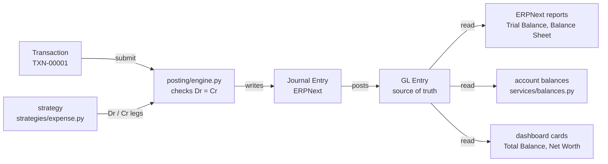

# Architecture

How `moneytracker` works, what each piece signifies, and the whole picture (spec §85).

`moneytracker` is a Frappe v15 app: a personal finance manager with an accounting-grade
ledger underneath and a deliberately simple model on top.

---

## The one decision

**The ledger is ERPNext's, not the app's own.**

A `Transaction` — the thing a user actually records — submits a balanced ERPNext
`Journal Entry`, which writes `GL Entry` rows. That single choice is why the app gets
General Ledger, Trial Balance, Balance Sheet, P&L and Cash Flow for free, and why nothing
in the app ever totals money by counting transactions.

Almost everything below is a consequence of it.

---

## What happens when you save an expense



The engine is the only code in the app that writes to the ledger. Everything to the right
of `GL Entry` is *derived* — drop the balances cache and the dashboard and the books are
still intact.

### Why the split between engine and strategy

A strategy is a pure function: it takes a `PostingContext` and returns a list of `Leg`
objects, touching no database. Each accounting rule is therefore readable on its own page
and unit-testable without a site. The engine does everything risky — validating that debits
equal credits, building the Journal Entry, submitting it, refreshing the balance cache.

The practical consequence: **adding a transaction type means adding a strategy, never
editing the engine.** Five are implemented (Expense, Income, Transfer, Credit Card Payment,
Refund); nine more are declared on the DocType and listed in `strategies.PLANNED`, so
attempting one fails with a sentence rather than a `KeyError`.

```
Transaction  (user-facing voucher, submittable)
    │ on_submit
    ▼
posting/engine.py ──uses──> posting/strategies/<type>.py   (returns Leg list)
    │ builds + submits
    ▼
ERPNext Journal Entry ──> GL Entry        ← single source of truth
    ▲
Balance Sheet · P&L · Cash Flow · Trial Balance · General Ledger
```

---

## Three entries that explain the model

### Expense — ₹1,000 restaurant bill, paid from HDFC

| Account | Debit | Credit |
|---|---:|---:|
| Restaurants *(expense)* | 1,000.00 | |
| HDFC Bank *(asset)* | | 1,000.00 |

One movement, two sides: spending on Restaurants rises and the bank balance falls by the
same amount. Pay by credit card instead and the credit lands on the card's liability
account — which is why a card balance *grows* where a bank balance shrinks.

### Transfer — ₹10,000 moved from HDFC to SBI

| Account | Debit | Credit |
|---|---:|---:|
| SBI Bank *(asset)* | 10,000.00 | |
| HDFC Bank *(asset)* | | 10,000.00 |

Both sides are balance-sheet accounts, so a transfer **cannot** appear as income or
expense — not by policy, but by construction. Moving your own money between pockets is the
classic way a naive tracker double-counts spending.

### Refund — ₹300 refunded against that bill

| Account | Debit | Credit |
|---|---:|---:|
| HDFC Bank *(asset)* | 300.00 | |
| Restaurants *(expense)* | | 300.00 |

The refund credits the category the money was spent on, so net spending on Restaurants
reads 700. Booking it as income would overstate both income and expense for the month
while leaving the bank balance identical — the error would never show up in a
reconciliation.

---

## What each thing signifies

| Thing | Signifies |
|---|---|
| **Transaction** — `TXN-00001`, submittable | What the user records: the voucher. Submitting posts to the ledger; cancelling reverses it. Never edited after submission, never deleted once posted. |
| **Money Account** — `ACC-00001` | Where money sits: a bank, a wallet, a credit card. Backed 1:1 by an ERPNext `Account` created for it automatically — the user never picks a ledger account. |
| **Category** — `CAT-00001`, tree | What money was for. A NestedSet tree: a **group** is a heading that holds no ledger account and cannot be posted to, so *Food 4,500* is always exactly the sum of its leaves. |
| **Tracker** — `TRK-00001` | Whose books these are. Registered as an ERPNext **Accounting Dimension**, so it is stamped on every GL row and every standard report can be filtered by it — which is why the app contains no per-user reporting code at all. |
| **Money Goal** — `GOL-00001` | A target and a window — save this much, keep under that, reach this net worth. Stores **no progress**: every figure is measured from the ledger on read, so cancelling a transaction cannot leave a counter stranded. |
| **Money Budget** — `BGT-00001` | An envelope that refills every period. Not a goal: a goal is one window with a deadline, a budget *repeats*, and carries a Period and a Rollover that a goal deliberately has not got. Stores no spending either. |
| **Money Settings** — Single | The one place a company, base currency, cost centre and chart-of-accounts parents are resolved. Nothing in the app hardcodes any of them. |
| **Leg** — `posting/leg.py` | One side of an entry: an account and either a debit or a credit, never both. A frozen dataclass that refuses to exist in an invalid state. |
| **Strategy** — `posting/strategies/` | The accounting rule for one transaction type, as a pure function returning legs. One module each. |
| **Engine** — `posting/engine.py` | The only code that writes to the ledger: validates, builds, submits, reverses, refreshes balances. |
| **Journal Entry · GL Entry** | ERPNext's ledger. The Journal Entry is the document, the GL rows are the postings. Cancelling writes reversing rows rather than deleting history. |
| **`ledger_account`** | The ERPNext `Account` behind a Money Account or Category. Provisioned by `services/coa.py`; read-only in the UI. |

---

## Three bridges into ERPNext

**Accounts are created, never chosen.** `services/coa.py` provisions an ERPNext `Account`
for every Money Account and Category, mapping the app's account type to a
(root type, ERPNext account type, parent) triple. Users see "HDFC Bank", not a chart of
accounts. Matching is by account name **and root type** — ERPNext's standard chart ships
`Salary` as an *expense* account, so matching on name alone once handed an income category
the expense account and sent wages into expenses. When the plain name is taken by another
root type, the new account is qualified: `Salary (Income) - T`.

**One company, many people.** Everyone posts into a single shared ERPNext Company
(`Trackify`), so nothing in the ledger separates one person's books from another's —
`money_tracker/permissions.py` does, through `permission_query_conditions` and
`has_permission` keyed on Tracker ownership. It is the only thing that does, which makes it
security code rather than convenience code.

**A widened Select.** Every `Journal Entry Account` row points back at the Transaction that
caused it via `reference_type` / `reference_name`. ERPNext ships `reference_type` as a fixed
Select, so `patches/v1_0/allow_transaction_reference.py` appends `Transaction` to its
options. Without that patch **nothing can be submitted at all** — every strategy fails
identically on Frappe's select validation.

---

## What keeps it honest

- **The ledger is the truth.** `Money Account.current_balance` is a cache, always
  *recomputed* from `GL Entry` (`services/balances.py`), never incremented in place — an
  incremental counter drifts and gives no sign that it has.
- **Debits equal credits, checked before anything is written.** ERPNext revalidates on
  submit, but then the error names a Journal Entry the user has never heard of.
- **Transfers and credit-card payments touch only balance-sheet accounts**, so they can
  never surface as income or expense.
- **A refund credits the category**, it is not income.
- **History is reversed, not erased.** Cancelling writes reversing GL rows; `on_trash`
  blocks deleting a posted transaction.
- **A group Category is a heading** — no ledger account, nothing postable to it, and its
  total is the sum of its leaves rather than a mix of its own postings and theirs.
- **Balances are scoped by Tracker, not just by account.** One ERPNext Account is shared by
  every tracker using the same account name, so a query filtered by account alone sums
  other people's money.
- **Money arithmetic uses `flt` with precision-based comparison**, matching ERPNext's own
  idiom rather than fighting it.

---

## Layout

```
moneytracker/money_tracker/
  doctype/          Transaction · Money Account · Category · Tracker · Money Settings · …
  posting/
    engine.py       the only writer to the ledger
    context.py      PostingContext — everything a strategy needs, resolved once
    leg.py          Leg — one side of an entry
    strategies/     one pure module per transaction type
  services/
    coa.py          provisions ERPNext Accounts
    balances.py     balances and net worth, derived from GL Entry
    categories.py   the default category tree, roll-up totals and net spend by day
    trends.py       per-period income and expense series, behind both trend charts
    goals.py        GOAL_TYPES — one measure per kind of goal, all derived on read
    budgets.py      PERIODS — the envelope calendar, the rollover and the alert job
    settings.py     accessors for Money Settings
    fx.py           currency conversion, over ERPNext's Currency Exchange
  api/              whitelisted endpoints, incl. the dashboard number cards
  number_card/      the seven shipped Number Card fixtures
  dashboard_chart/  the four shipped charts, over three Dashboard Chart Sources
  demo.py           the demo household — seed and teardown, bench execute only
  permissions.py    row-level security — the only user isolation there is
  workspace/        the Desk workspace
moneytracker/tests/ cross-cutting suite (doctype rules live beside their controllers)
moneytracker/patches/v1_0/
```

---

## Where it stands

Phase 1 is complete; Phase 2 has goals and budgets. All of it is covered by **426 tests**
(`bench --site tracker.localhost run-tests --app moneytracker`).

| | |
|---|---|
| **5** | posting strategies implemented, of fourteen declared types |
| **7** | dashboard Number Cards — balance, net worth, income, expenses, savings rate, goals, budgets |
| **4** | Dashboard Charts — income vs expense, spending trend, goal progress, budget vs actual |
| **6** | kinds of `Money Goal`, each a row in `GOAL_TYPES` plus one small measure function |
| **4** | budget periods — weekly, monthly, quarterly, yearly — each a row in `PERIODS` |
| **38** | categories seeded for a new tracker, as a two-level tree |

Goals and budgets share one habit with `Money Account.current_balance`: **they store nothing
they could derive**. A stored counter drifts the first time a transaction is cancelled, and
nothing in the data says that it has. The one exception is a budget's `last_alert`, which is
bookkeeping about a message that was sent rather than anything about the money.

A demo household (`money_tracker/demo.py`, run from `bench execute`) seeds six months of
deterministic transactions, one goal of every type and five budgets, and removes them again,
so the app can be shown in the state it is meant to be used in. The frontend is deliberately
deferred — Phase 1 is the backend and Desk only.

See `CLAUDE.md` for working conventions and `task.md` for the current resume point.
